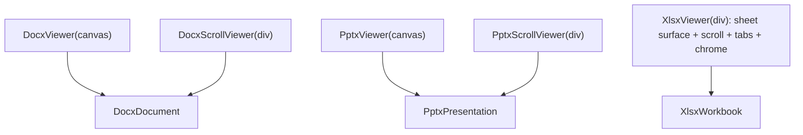
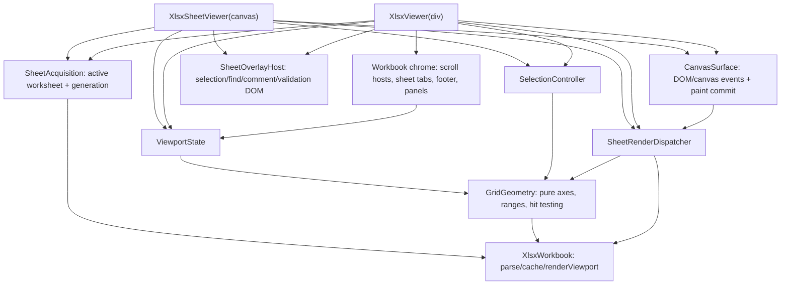
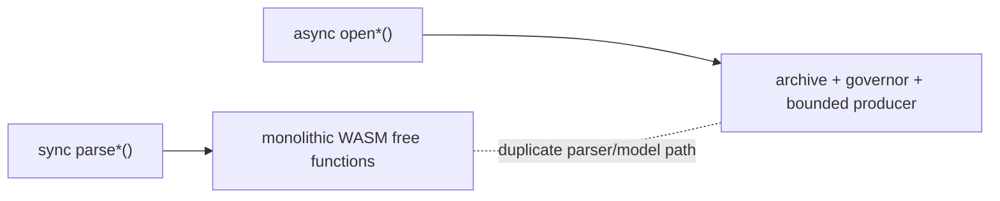
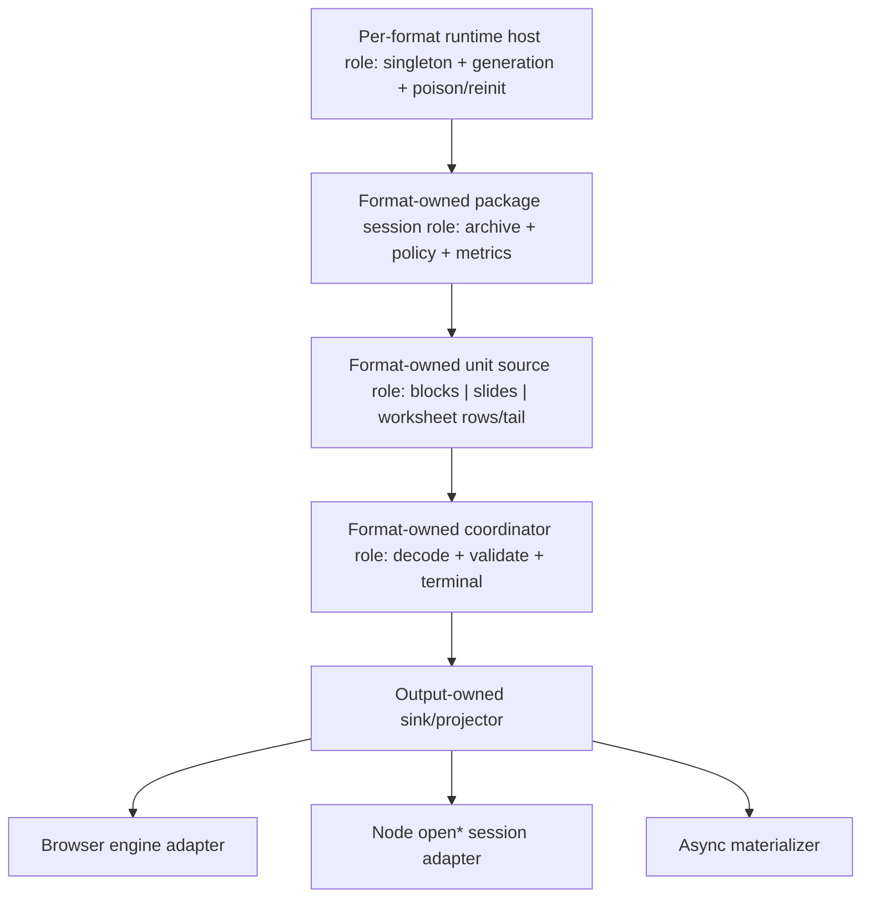

# 0.76に向けたOOXML公開APIの統合設計

English: [`api-architecture-0.76.md`](api-architecture-0.76.md)

ステータス: 0.76.0で実装済み。本書は0.76以降の公開API、ownership、
責務境界を維持するためのarchitecture baselineとする。

関連Issue: [#1133](https://github.com/yukiyokotani/office-open-xml-viewer/issues/1133)、
[#1134](https://github.com/yukiyokotani/office-open-xml-viewer/issues/1134)。

## 決定事項の要約

0.76は明示的な破壊的マイナーリリースとし、関連する次の2つのAPI統合作業を
一度のリリースで完了する。

1. 不足しているCanvasマウント型のXLSXシートViewerを追加し、既存の
   containerマウント型Workbook Viewerも同じシート実装を合成して利用する。
2. 有用な用途を、`open*` APIと同じ所有型セッションパイプラインに基づく
   非同期materializerへ置き換えたうえで、Nodeの同期materializing parser群を削除する。

同時に、#1133の設定可能なarchive entry-count policyを、既存の共有
resource-governance control planeを通して追加する。

全体を統一する原則は、**各形式が所有する単位ごとにcanonical acquisition、
unit source、decode/validation coordinatorを1つだけ持つこと**である。

- DOCXは文書ブロックを順に生成し、pageへlayoutする。
- PPTXは完全なslideを生成する。
- XLSXは完全なworksheet row群と、最後にworksheet tailを生成する。

Viewer、Node session、materializing convenienceは異なるoutput-owned projectorを
使ってよいが、同じvalidated unitをconsumeする。同じOOXML contentのparse、normalize、
resource accounting、terminal validationを別実装で行ってはならない。

## 目標

- page、slide、worksheetの意味を無理に同一視せず、Browser APIの構造を対称にする。
- 所有型の非同期Node sessionを、唯一のproduction parser/resource lifecycleにする。
- parser、normalization、resource policy、worker dispatch、viewer surfaceの重複をなくす。
- DOCXのpaginationは逐次的、PPTXのslideは独立、XLSXは非常に大きくなり得る
  worksheetの一部viewportを表示する、という実在する形式差を保つ。
- 新API、migration、実装統合、test、documentationを0.76でまとめて提供する。

## 非目標

- 単一のgenericな公開`OfficeViewer<T>`抽象を作ること。
- page、slide、worksheet modelに同一のcontent access methodを強制すること。
- XLSX worksheet全体を1枚のbitmapに描画すること。
- Workerや`Atomics.wait`でPromiseをblockし、同期Node APIを維持すること。
- deprecation期間のために旧新parser実装を両方残すこと。

## 過剰な共通化を行わない対称性

本設計における対称性は、役割が認識しやすくownershipが一貫していることを意味し、
1つの共通content modelやgeneric実装を意味しない。DOCX pagination、PPTX slide acquisition、
XLSX worksheet streamingは別概念であり、別々のまま維持する。

後述するroleの語彙は、各format package内で適用するarchitecture checklistである。
共通`FormatUnitSource` interface、base class、generic coordinator/projector、形式semantics用の
共有state machineを要求しない。実装は、layout/model projectorを持つDOCX unit coordinator、
PPTX slide repository/preflight projector、XLSX worksheet row/tail coordinatorのように
形式名を持ち、各形式が所有する。

共有するのは、同一性が証明されたmechanicsだけとする。Package policy normalization、
archive ownership、format-runtime generation/poison/reinit、pull credit/ACK transport、terminal-outcome
precedence、static bitmap ownership、pure zoom mathが該当する。共有helperにpage/slide/worksheet
固有の分岐が必要なら抽象が広すぎるため、その処理はformat packageへ残す。

## 不変条件

1. 開かれたOOXML packageは、retained archive owner、resource governor、
   normalized policy、終端のclose/failure結果をそれぞれ1つだけ持つ。
2. `close()`と`destroy()`はidempotentとする。close後のresource-dependentな処理は
   rejectし、保持済みのimmutable metadataは参照可能とする。
3. Browser main mode、Browser worker mode、Nodeは、同じformat-owned
   parser/projectorとpolicy/error vocabularyを使う。
4. Materializationはcanonicalなbounded unit sourceとdecode/validation coordinatorを、
   明示的なoutput-owned sink経由でconsumeする。別のWASM free-function parser pathではない。
5. Materialized resultは、内容量に比例するcaller-owned memoryであることを明記する。
6. Composite Viewerは各formatのfocused-view内部実装を合成し、rendering、selection、hit-test、
   text layer、worker/bitmap dispatchをコピーしない。
7. 共通lifecycle/transportは`core`、共有OOXML package/parser policyは
   `ooxml-common`、形式固有の意味は各format packageに置く。

## 0.76より前のBrowser architecture

### 公開surface

| Layer | DOCX | PPTX | XLSX |
| --- | --- | --- | --- |
| 所有型rendering engine | `DocxDocument` | `PptxPresentation` | `XlsxWorkbook` |
| Canvasマウント型focused view | `DocxViewer(canvas)` | `PptxViewer(canvas)` | なし |
| Containerマウント型composite | `DocxScrollViewer(div)` | `PptxScrollViewer(div)` | `XlsxViewer(div)` |
| Render unit | page | slide | worksheet viewport |

`XlsxWorkbook.renderViewport()`は正しい低レベルrendering primitiveだが、Viewerではない。
利用者自身がworksheetのload、viewport geometryの算出、redraw scheduling、
main/worker差の処理、selection管理、pointer座標のmappingを行う必要がある。

### 現在の依存関係



DOCX/PPTXのunit viewerとscroll viewerは正しく同じengineを呼んでいるが、
render scheduling、main/worker bitmap transfer、canvas generation guard、zoom、
overlay、error routingの類似実装をそれぞれが所有している。XLSX Viewerは、
sheet描画・interactionとcontainer chromeが1つの大きなclassに結合している。

## 現在のBrowser architecture（0.76以降）

### 公開surface

<!-- viewer-api-symmetry-contract -->

| Layer | DOCX | PPTX | XLSX |
| --- | --- | --- | --- |
| 所有型rendering engine | `DocxDocument` | `PptxPresentation` | `XlsxWorkbook` |
| Canvasマウント型focused view | `DocxViewer(canvas)` | `PptxViewer(canvas)` | `XlsxSheetViewer(canvas)` |
| Containerマウント型composite | `DocxScrollViewer(div)` | `PptxScrollViewer(div)` | `XlsxViewer(div)` |
| 主navigation | `goToPage()` | `goToSlide()` | `goToSheet()` |
| 主count | `pageCount` | `slideCount` | `sheetCount` |

この表はhost integrationとlifecycle contractだけを横に並べたものであり、DOCX page、
PPTX slide、XLSX sheetを同一のdomain unitとみなすものではない。Viewer境界も1つの
抽象へ強制しない。各formatは、1 page、1 slide、active sheet viewportという
自然な関心単位を維持する。

Engine methodの対応関係は次のとおりとする。

| Contract | DOCX | PPTX | XLSX |
| --- | --- | --- | --- |
| Packageのparseと保持 | `DocxDocument.load()` | `PptxPresentation.load()` | `XlsxWorkbook.load()` |
| Canvasへの直接描画 | `renderPage(target, pageIndex, options)` | `renderSlide(target, slideIndex, options)` | `renderViewport(target, sheetIndex, range, options)` |
| Bitmap描画 | `renderPageToBitmap(pageIndex, options)` | `renderSlideToBitmap(slideIndex, options)` | `renderViewportToBitmap(sheetIndex, range, options)` |
| Render modeのowner | `DocxDocument.mode` | `PptxPresentation.mode` | `XlsxWorkbook.mode` |
| Retained resourceの解放 | `destroy()` | `destroy()` | `destroy()` |

2段階のViewerも、同じacquisitionとownership contractに従う。

| Contract | DOCX | PPTX | XLSX |
| --- | --- | --- | --- |
| Canvas mount先 | `DocxViewer(canvas)` | `PptxViewer(canvas)` | `XlsxSheetViewer(canvas)` |
| Compositeのmount先 | `DocxScrollViewer(container)` | `PptxScrollViewer(container)` | `XlsxViewer(container)` |
| Viewer所有のacquisition | `viewer.load(source)` | `viewer.load(source)` | `viewer.load(source)` |
| 借用engine factory | `fromDocument()` | `fromPresentation()` | `fromWorkbook()` |
| 借用時の規約 | `load()`はreject、callerがengineを破棄 | `load()`はreject、callerがengineを破棄 | `load()`はreject、callerがengineを破棄 |

`load()`と名前付きengine factoryは、1つのViewerへ同時に存在する競合sourceではない。次の排他的な
ownership modeを選択する。

- `new Viewer(target)`の後に`viewer.load(source)`を呼ぶ経路はconvenience pathであり、
  Viewerがengineの生成、置換、破棄を行う。
- `Viewer.fromDocument()`、`Viewer.fromPresentation()`、`Viewer.fromWorkbook()`は
  reuse pathである。
  callerは1つのparse済みengineを複数Viewで共有でき、Viewerはengineを置換・破棄しない。

両方を維持することで、一般的な1 View用途にengine管理を強制せず、master/detailや
複数Window用途ではparse、archive cache、worker、font登録の重複を避けられる。公開例は
`viewer.load()`を基本形とし、名前付きfactoryは高度な再利用経路として説明する。

既存の公開名は維持する。`XlsxScrollViewer` aliasは追加しない。Container componentは
whole sheetの一覧ではなく、sheet tabとscrollable cell gridを持つWorkbook Viewerだからである。

各Canvasマウント型ViewerとContainerマウント型Viewerは、format固有の名前付きfactoryを
持つ。6つすべてで、借用engineがrender modeとlifecycleを所有する。
明示的に競合する`mode`は拒否し、`load()`は利用不可、Viewerの破棄では借用engineを
破棄しない。engineはすでにload済みなのでfactoryは同期であり、従来から非同期だった
描画・navigationだけが引き続き非同期となる。

### XLSX Canvas Viewerのcontract

`XlsxSheetViewer`は、1つのactive worksheet viewportをCanvasへマウントして表示する。
sheet tab/footer chromeは所有しない。worksheetのnative scrollbarは既定で有効とし、host側が
独自のviewport navigationを提供する場合だけ明示的に無効化できる。worksheetは有限pageでは
ないため、形式固有のviewport移動を追加で公開する。この状態をDOCX/PPTXへ無理に持ち込まない。

`XlsxWorkbook.renderSheet()`は意図的に用意しない。OOXML worksheetは最大1,048,576行、
16,384列を持ち、Browser Canvasのdimensionとbacking memoryの上限を大幅に超えうる。
DOCX pageやPPTX slideと異なり、worksheetには1枚のCanvasへ対応する有限の自然サイズがない。
したがって低レベルcontractは`renderViewport()`で明示的な`ViewportRange`を必須とする。
高レベルの「1 sheet表示」は、`XlsxSheetViewer`がscroll offset、visible range、resize
projection、redraw schedulingを所有することで提供する。将来full-sheet export APIを追加する
場合は、明示的な範囲とtileまたはpaginationを持つ別contractとし、誤解を招く
`renderSheet()` aliasにはしない。

### 対称性の自動検査

`scripts/check-viewer-api-symmetry.mjs`は、3形式のcommit済みpublic declaration baselineを
検証する。Engineの`load`/mode/count/render/bitmap/destroy、Canvas/Container constructorの
mount先、Viewerの`load`/zoom/navigation/destroy、名前付き借用engine factory、旧
`document`/`presentation`/`workbook`注入optionが存在しないことを確認する。また、無制限
worksheetを1枚とみなす`XlsxWorkbook.renderSheet()`を
拒否し、このsectionが英語版・日本語版の両方に存在することも検査する。
`check:public-api:built`がdeclaration baseline検証後にCIで実行するため、意図的なAPI変更では
implementation、baseline、対称性matrix、documentationを同時に更新する必要がある。

mount用DOM、style、DPR参照、document listenerは`canvas.ownerDocument`とその
`defaultView`を基準に解決する。これにより親画面が1つの`XlsxWorkbook`を保持したまま、
同一originの別WindowにあるCanvasへ借用Sheet Viewerをマウントでき、packageの再parseは
発生しない。

実装前に、次のcontractを中心に公開declarationを確定する。

```ts
export interface XlsxViewportOffset {
  /** Sheetのlogical startからの水平CSS pixel。常に0以上。 */
  readonly x: number;
  /** Sheet上端からの垂直CSS pixel。常に0以上。 */
  readonly y: number;
}

export interface XlsxScrollToCellOptions {
  readonly align?: 'nearest' | 'start' | 'center' | 'end';
}

export interface XlsxSheetViewerOptions extends LoadOptions {
  readonly cellScale?: number;
  readonly resizable?: boolean;
  readonly showScrollbars?: boolean;
  readonly zoomMin?: number;
  readonly zoomMax?: number;
  readonly onScaleChange?: (scale: number) => void;
  readonly onReady?: (sheetNames: string[]) => void;
  readonly onSheetChange?: (index: number, total: number) => void;
  readonly onViewportChange?: (offset: XlsxViewportOffset) => void;
  readonly onSelectionChange?: (selection: CellRange | null) => void;
  readonly onHyperlinkClick?: (target: HyperlinkTarget) => void;
  readonly enableHyperlinks?: boolean;
  readonly selectionColor?: string;
  readonly findHighlightColors?: FindHighlightColors;
  readonly mode?: 'main' | 'worker';
  readonly hiddenSheetMode?: HiddenSheetMode;
  readonly onError?: (error: Error) => void;
}

export class XlsxSheetViewer implements ZoomableViewer {
  static fromWorkbook(
    canvas: HTMLCanvasElement,
    workbook: XlsxWorkbook,
    options?: XlsxSheetViewerOptions,
  ): XlsxSheetViewer;
  constructor(canvas: HTMLCanvasElement, options?: XlsxSheetViewerOptions);
  load(source: string | ArrayBuffer): Promise<void>;
  readonly sheetIndex: number;
  readonly sheetCount: number;
  readonly sheetNames: string[];
  readonly canvasElement: HTMLCanvasElement;
  goToSheet(index: number): Promise<void>;
  nextSheet(): Promise<void>;
  prevSheet(): Promise<void>;
  getViewportOffset(): XlsxViewportOffset;
  setViewportOffset(offset: XlsxViewportOffset): Promise<void>;
  scrollToCell(ref: string, options?: XlsxScrollToCellOptions): Promise<void>;
  relayout(): Promise<void>;
  getScale(): number;
  setScale(scale: number): void;
  zoomIn(): void;
  zoomOut(): void;
  fitWidth(): void;
  fitPage(): void;
  getCellAt(clientX: number, clientY: number): CellAddress | null;
  readonly selection: CellRange | null;
  select(ref: string): void;
  setSelectionColor(color: string): void;
  setHiddenSheetMode(mode: HiddenSheetMode): Promise<void>;
  readonly hiddenSheetMode: HiddenSheetMode;
  readonly visibleSheetCount: number;
  findText(query: string, options?: FindMatchesOptions): Promise<FindMatch<XlsxMatchLocation>[]>;
  findNext(): Promise<FindMatch<XlsxMatchLocation> | null>;
  findPrev(): Promise<FindMatch<XlsxMatchLocation> | null>;
  clearFind(): void;
  getResourceMetrics(): Promise<OoxmlResourceMetrics>;
  destroy(): void;
}

export interface XlsxViewerOptions extends XlsxSheetViewerOptions {
  readonly showZoomSlider?: boolean;
}
```

`fromWorkbook()`は、DOCX Viewerの`fromDocument()`、PPTX Viewerの
`fromPresentation()`と同じ名前付きfactory contractに従う。返されたViewerでは`load()`は
利用不可、engine自身のrender modeを正とし、Viewerの破棄ではcaller-owned engineを破棄しない。
初回描画の完了点が必要なcallerは`goToSheet(index)`をawaitする。
複数のsheet viewerはparse、archive access、worksheet materialization、immutable content cacheを
共有しながら、viewport、selection、zoom、resize、outline、render generationを独立して保持する。

Offsetは現在scaleにおけるlogical CSS pixelとする。`x`はBrowserのRTL `scrollLeft`
規則に依存せず、column A側のlogical startから後続column方向へ増加し、`y`は下方向へ
増加する。これによりpartial cellも表現できる。入力はfinite値に限定して使用範囲へ
clampし、callbackにはclamp後の値を渡す。

CanvasのCSS boxをviewport width/heightとし、DPRはbacking-store resolutionだけに影響する。
`relayout()`でCSS boxを再取得する。共有caller-canvas lifecycleでcanvasをwrapし、
destroy時に元へ戻す。Native scrollbarを明示的に隠した場合もWheel/trackpadでviewportを
panできる。touch-pinchは今回のscope外とする。

`destroy()`はidempotentでinstanceを恒久的にcloseする。Destroy後のasync mutation
（`load`、navigation、viewport/relayout、hidden-mode変更、find traversal）は
`Error("XlsxSheetViewer is destroyed")`でrejectする。同期mutation（selection、color、
clear-find、zoom）は同じerrorを同期throwする。`getCellAt()`は`null`を返す。
保持済みimmutable snapshot（sheet index/count/name、viewport offset、selection、scale、
hidden mode/count、最後のresource metrics、`canvasElement`）は参照可能とする。
Caller canvasはすでに元へ戻し、late bitmapはcommitせずdisposeする。



これらは内部composition unitであり、公開抽象ではない。各`XlsxViewer`と
`XlsxSheetViewer`は、それぞれ独立したstateで同じ実装をinstantiateする。2つのfacadeが
1つのmutable runtime instanceを共有したり、実装をコピーしたりしてはならない。

抽出する責務は次のとおり。

- `SheetAcquisition`: worksheet loadとgeneration-safeな入れ替え。
- pure `GridGeometry`: row/column axis、frozen pane、visible range、hit test。
- `ViewportState`: logical offset、scale、viewport extent。
- `SelectionController`: active cellとselection transition。
- `SheetRenderDispatcher`: render scheduling、generation check、main/worker bitmap ownership。
- `CanvasSurface`: canvas/DPR sizingとpointer/keyboard event adaptation。
- `SheetOverlayHost`: mount固有のcanvas wrapper内にselection/find overlayと、anchorされた
  comment/validation panelを配置する。

共有componentはinteraction eventとanchor geometryをemitする。各facadeは自身のcanvas
wrapper内で同じoverlay-host実装をinstantiateする。Container Viewerだけがnative scroll
element、workbook tab、footer control、zoom chromeを所有する。

### DOCX/PPTX Viewerの統合

DOCX/PPTXは形式adapterを分けたまま、すでに意味が同じ次の実装primitiveを共有する。

- staticかつgeneration-safeなCanvas render-result dispatch（main canvasとworker bitmap）。
- caller-owned Canvasのmount/restoration。
- text、hyperlink、find-highlight overlay host。
- render cancellation/stale result disposal。
- 共通zoom計算とlifecycle error routing。

PPTX media presentation handleとper-slot media lifetimeはPPTX固有のままにし、static
bitmap dispatcherへ押し込めない。Scroll Viewerはsingle-canvas Viewerと同じstaticな
形式adapterを再利用する。Virtualization、
pooled slot、visible-range calculation、scroll anchoringはScroll Viewerの責務として残す。
これにより、形式layoutを誤ってgeneric化せず、共通mechanicsだけを重複排除する。

## 現在のNode architecture

公開`@silurus/ooxml/node` subpathには現在2世代が共存している。

### 同期materializer

- `parseDocx()`はmonolithicな`parse_docx` WASM exportを呼ぶ。
- `parsePptx()`はmonolithicな`parse_pptx` WASM exportを呼ぶ。
- `parseXlsx()`は`parse_xlsx`を呼び、`parseXlsxSheet()`はpackageを別に開き直して
  parseし、`parseXlsxAllSheets()`もsheet materializerを繰り返す。

これらはmodelを即時に返すが、owned sessionのresource policy、cancellation、metrics、
retained archive、cleanup contractを共有していない。

公開`extractPptxMedia()`と`extractPptxImage()`は第3のescape pathである。Packageを
開き直し、owned sessionのpolicy/lifecycle外でfree WASM extraction exportを呼ぶため、
これらも0.76のmigration対象に含める。

### 非同期owned session

- `openDocxDocument()`はbounded document cursorを消費し、pageをlayout/renderして明示的にcloseする。
- `openPptxPresentation()`はretained archiveから完全なslideを消費する。
- `openXlsxWorkbook()`はworkbook indexを保持し、worksheet rowをstreamする。

Sessionはlifecycleの概念を共有しているが、format packageとNode facadeにはarchive open、
resource metrics、transport setup、failure normalization、close orchestrationの重複が残る。



## 改修後のNode architecture

### 必須のcanonical role

各形式は、Browser engine、Node facade、materializerが利用する次の必須内部roleを持つ。

1. Format/JavaScript realmごとのruntime hostが、wasm-bindgen module singleton、
   `WasmParserHost`、runtime generation、live archive registration、poison transition、
   reinitializationを所有する。
2. 所有型package sessionは1つのruntime generationに属し、1つのarchive handle、
   normalized policy/governor、metrics、abort、closeを所有する。
3. 形式所有unit sourceは、document block、slide、worksheet row/tailを生成する唯一の
   acknowledged sourceである。
4. Canonical format unit coordinatorは、wire decode、normalization、accounting、ACK order、
   terminal validation、rollback/commit eligibilityを実装する唯一の場所である。
5. 明示的なoutput-owned sink/projectorがvalidated unitをconsumeする。DOCXは
   `DocxLayoutProjector`と`DocxCompatibilityMaterializer`を別sinkとして持つ。保持ownershipは
   異なってよいが、unit streamをreparse、renormalize、revalidateしてはならない。

これらのroleは形式ごとに別実装とする。共有するのは低レベルownership/transport primitiveであり、
genericなcontent-session APIではない。

wasm-bindgenはmodule singletonであるため、sessionが独立してWASMをreinitializeしてはならない。
Trap時は同じformat/runtime generationの全live sessionをatomicにpoisonし、破棄済みinstanceを
呼ばずに無効なarchive handleをdetachした後、runtimeを一度だけreinitializeする。既存sessionは
failedのままとし、以後openするsessionは新generationを使う。Sessionを別Workerへ分離する最適化は
可能だが、このrealm-local safety contractは変えない。

Environment adapterはWorker/in-process transport、Browser/Nodeのcanvas/resource serviceを
供給するが、第2のparser state machine、unit coordinator、poison policy、reinitialization pathは所有しない。



小さなlifecycle primitive、terminal-outcome helper、同一性が証明されたin-process/Worker
transport mechanicsは`core`に置き、各形式がそれらから自身のstate transitionを構成する。
Archive preflight/resource enforcementは`ooxml-common`に置く。
Complete-unit parse、model projection、layout semanticsは、
`@silurus/ooxml-docx/internal/session`のような明示的internal build entryを持つformat packageが
所有する。Node facadeはsource bytesとNode canvas serviceをadaptしてよいが、parser/WASMの
private fileをdeep importしたりformat orchestrationを再構築したりしてはならない。

DOCXでは、canvas-freeなprivate `DocxAcquisitionSession`がarchiveとdocument cursorを所有する。
1つの`DocxDocumentUnitCoordinator`が全unitをdecodeしterminal validationする。
`openDocxDocument()`は`DocxLayoutProjector`をattachしてmeasurement serviceを作り、
`materializeDocxDocument()`は`DocxCompatibilityMaterializer`をattachする。どちらのsinkも他方の
document-sized graphを構築せず、parse、normalization、accounting、ACK、terminal validationを所有しない。

### 0.76以降の公開Node surface

Canonicalなowned APIは維持する。

```ts
openDocxDocument(source, options)
openPptxPresentation(source, options)
openXlsxWorkbook(source, options)
```

形式固有の操作（`pages()`、`slides()`、`worksheetRows()`）は維持する。
共通lifecycle semanticsはgenericな公開interfaceへ押し込めず、1つの共有contract suiteで検証する。

次の同期関数は削除する。

```ts
parseDocx
parsePptx
parseXlsx
parseXlsxSheet
parseXlsxAllSheets
```

有用なfull-model/index用途には、明示的に非同期かつmaterializingな代替を提供する。

```ts
materializeDocxDocument(source, options): Promise<DocxDocumentModel>
materializePptxPresentation(source, options): Promise<Presentation>
materializeXlsxWorkbookIndex(source, options): Promise<ParsedWorkbook>
materializeXlsxWorksheet(source, sheetIndex, options): Promise<Worksheet>
materializeXlsxWorkbook(source, options): Promise<MaterializedXlsxWorkbook>
```

後述するindex-only caseを除き、これらは同じoptionsをnormalizeし、canonical owned producerを
開き、validated unitをcanonical coordinatorからoutput-owned sinkへ渡して、`finally`でcloseする。
形式要件が異なる場合、公開rendering-oriented wrapperを無理に呼ぶのではなく、`open*`と同じ
内部acquisition session、unit source、coordinatorを必ず利用する。Monolithicな
`parse_*`/`parse_sheet` compatibility exportを呼んではならない。

`materializeXlsxWorkbookIndex()`は意図的にmetadata-onlyとする。Canonical owned package
sessionを開き、`openXlsxWorkbook()`と同じindex decoder/normalizerからworkbook bootstrapを取得し、
caller-owned indexをdetachして、worksheet cursorを開かずcloseする。

XLSXのownership contractを次のように明示する。

```ts
export type ReadonlyParsedWorkbook = DeepReadonly<ParsedWorkbook>;

export interface XlsxWorkbookSession {
  readonly workbookIndex: ReadonlyParsedWorkbook;
  readonly sheetCount: number;
  readonly sheetNames: readonly string[];
  readonly resourceUsage: OoxmlResourceUsageSnapshot | undefined;
  worksheetRows(sheetIndex: number): AsyncGenerator<XlsxWorksheetRowChunk>;
  close(): Promise<void>;
}

export interface MaterializedXlsxWorkbook {
  readonly workbookIndex: ParsedWorkbook;
  /** Workbookのsheet-index順に並ぶcaller-owned worksheet。 */
  readonly worksheets: readonly Worksheet[];
}
```

`workbookIndex`はclose後も参照可能かつruntimeでrecursively frozenとし、TypeScript上だけでなく
JavaScript callerもactive row assemblerのshared strings/stylesを変更できないようにする。Sessionは
同じfrozen graphをreadに使い、第2のcopyを保持しなくてよい。Materializerはdetachedなcaller-owned metadataと
worksheetを返し、terminal worksheetはsession close前に必ずdetachする。Workbook-index-only
resultをfully materialized workbookと誤解させる名前にはしない。

同期exportを削除する前に、Node rendering helperと`ooxml-thumbnail` CLIをowned session pathへ移行する。
PPTX image/media extractionもopen session経由とする。Source-based convenienceを残す場合は、
sessionを`finally`でcloseする非同期wrapperへ変更する。

0.76のmigration tableを次のように確定する。記載したreplacementが完成する前にexportを削除しない。

| 0.75 export | 0.76 replacement |
| --- | --- |
| `parseDocx()` | `await materializeDocxDocument()` |
| `parsePptx()` | `await materializePptxPresentation()` |
| `parseXlsx()` | `await materializeXlsxWorkbookIndex()` |
| `parseXlsxSheet()` | `await materializeXlsxWorksheet()` |
| `parseXlsxAllSheets()` | `await materializeXlsxWorkbook()` |
| `extractPptxImage()` | `openPptxPresentation()`内の`await session.getImage()` |
| `extractPptxMedia()` | `openPptxPresentation()`内の`await session.getMedia()` |

### Lifecycle contract

Owned sessionは`opening`、`open`、`closing`、`closed`、`failed` stateを持ち、session ownerだけが
transitionする。`close()`は一度だけlinearizeして1つのPromiseをmemoizeし、新しい
resource-dependent workをrejectする。受理済みin-flight workを形式contractに従ってawait/cancelし、
archiveをreleaseしてidempotentにsettleする。繰り返し呼び出してもcleanup rejectionを含め同じ
settlementを返す。Parse/resource/abort failureをprimaryとし、cleanup failureはprimary failureがない場合だけ
reportする。Materializerは`usingOwnedSession`でこのprecedenceを共有する。

Immutable snapshot（`pageCount`/page size、slide dimension/count、`workbookIndex`/sheet name/count、
最後のresource usage）はclose後も参照可能とする。Resource read、rendering、extraction、新streamはrejectする。

DOCX `pages()`とPPTX `slides()`はterminal one-pass iteratorであり、exhaustion、break、errorでsession全体を
closeする。XLSX `worksheetRows()`はworksheet operationだけをcloseし、次のsheetのためworkbook sessionを
openのまま保つ。これらは共有test上の別々のformat contractとし、同じiteration semanticsに見せかけない。

### Migration例

旧API:

```ts
const presentation = parsePptx(buffer);
```

新しいmaterialized利用:

```ts
const presentation = await materializePptxPresentation(buffer);
```

新しいbounded sequential利用:

```ts
const presentation = await openPptxPresentation(buffer, options);
try {
  for await (const slide of presentation.slides()) {
    // caller-ownedなslideを1つずつ処理する。
  }
} finally {
  await presentation.close();
}
```

非同期sessionの同期wrapperは作らない。同期APIを模倣する目的でWorker threadや
`Atomics.wait`を利用してはならない。通常の非同期Worker transportとsessionごとの
Worker isolationは許可する。

## Archive entry-count policy（#1133）

`OoxmlResourceLimits`へ次を追加する。

```ts
maxArchiveEntries?: number | null;
```

Contractは次のとおり。

- 省略: generated/calibrated standard defaultを使用する。
- internal hard ceiling以下のpositive safe integer: そのpublic admission limitを適用する。
- `null`: public limitだけを無効にする。
- 0、負数、小数、非finite、hard ceiling超過: Worker/WASM生成前のoption normalizationでrejectする。

Internal hard ceilingは無効化できない。Public policy超過は`metric: "entry-count"`、
`configurable: true`の`OoxmlResourceLimitError`とする。Internal crossingは同じmetricで
`configurable: false`とする。

次を1つのatomicなgenerated-policy/ABI変更として行う。

- `packages/ooxml-common/resource-policy.json`へ`defaults.maxArchiveEntries`を追加する。
- TypeScript/Rust双方へstandard/hard entry-count constantを生成する。
- normalized policyとmetrics snapshotへfieldを追加する。
- 3形式のWASM archive constructorと`resourcePolicyForWasm`を3値policy ABIへ変更する。
- Rustの`public_entries`を既存hard ceilingより先にenforceする。

Defaultはpublic/private corpusで記録したmetricsと明文化したheadroomに基づきpolicy manifestから生成する。
Calibrationはchecked aggregate artifactまたはcommandから再現可能にする。値の選定と記録を実装gateとし、
現在の20,000 hard ceilingをcalibrationなしでpublic defaultへ流用しない。

Normalized policyは1つのobjectとしてBrowser main mode、render worker、Node session、
metrics、debug output、TypeScript worker protocol、3形式のWASM archive constructorへ渡す。
形式ごとのoption解釈は禁止する。

## Source ownershipと重複排除規則

次の状態はrelease blockerとする。

- productionからmonolithic Node `parse_*`/`parse_sheet` WASM exportを呼んでいる。
- 明示したnative/test allowlist以外のproduction Browser/Nodeから、`parse_docx`、`parse_pptx`、
  `parse_xlsx`、`parse_sheet`、archive `parse_sheet`を呼んでいる。
- legacy `parseSheet`/`parsedSheet` worker protocol armが残っている。
- owned session外でfree-function PPTX image/media extractionを行っている。
- format packageに第2のACK/credit/cancelまたはunit decode/terminal-validation実装がある。
- BrowserとNodeでresource-policy normalizationが分かれている。
- `XlsxSheetViewer`が`XlsxViewer`のmethodをコピーしている。
- `XlsxViewer`が別のgrid geometry/hit-test実装を維持している。
- DOCX/PPTXのViewerとScrollViewerが別々のmain/worker dispatch state machineを持つ。
- Materializerがunitごとにpackageを開き直す。
- Public entry-count handlingを各形式が個別に実装している。

Repository-wideなimport/AST boundary checkでparser/export/package boundaryをenforceする。
3形式すべての公開Node `open*` recovery testでruntime-generation poison/reinitializeを証明する。
Concurrent testでは2つのsessionを同時に開き、一方をtrapさせ、旧generationの両sessionが
stale pointerへ触れずdeterministicにfailし、新generationのsessionが成功することを確認する。

Model materializationとrender-oriented retained stateは、異なるownership contractを
満たすために異なってよい。これは意図的なdata ownershipであり、parse/normalization
algorithmの重複を許可するものではない。

## 実装順序

複数のPRを`main`へmergeしてよいが、次のgateをすべて満たすまでpackage/site releaseは行わない。
Resource/Node統合とBrowser Viewer統合は別々のworkstreamとしてgateし、同じ0.76で出荷する。
一方のscopeを理由に他方のacceptance criteriaを弱めない。

1. 0.76のAPI declarationと共通lifecycle/resource contractを確定する。
2. #1133をshared policy/governor pathと全boundary testへ実装する。
3. Format runtime host、owned package session、format unit source、canonical unit coordinator、
   output-owned projectorを抽出し、Browserの直接worksheet acquisitionとNode `open*` adapterを移行する。
4. Async materializerとequivalence testを追加し、Node CLI/rendering consumerを移行する。
5. 同期parser/extraction export、legacy worksheet worker protocol arm、monolithic production call pathを削除する。
6. XLSX sheet controller/surfaceを抽出し、`XlsxViewer`を移行してから、同じ実装上に
   `XlsxSheetViewer`を追加する。
7. DOCX/PPTXのformat layout semanticsを混ぜず、unit-viewerの共通mechanicsを統合する。
8. Public API baseline、README、site API reference、example、CHANGELOG、明示的な
   0.75から0.76へのmigration guideを更新する。
9. Independent architecture review、full CI、parser test、declaration build、Browser smoke test、
   private DOCX/XLSX/PPTX VRTを完了する。

## Release gate

- 旧同期parser exportがproduction declaration/bundle entryに残っていない。
- 0.76をbreakingと明記し、削除する全parser/extraction functionのper-export migration tableを提供する。
- 新materializerがmonolithic parser compatibility exportを呼ばない。
- Browser/Node production pathが禁止されたmonolithic parse/export callへ到達しないことを
  repository boundary checkでenforceする。
- 旧新の重複期間中にequivalenceを証明し、旧実装削除後のtestはlegacy parserを
  出荷せずcanonical expected modelを使う。
- `XlsxViewer`と`XlsxSheetViewer`が同じacquisition、geometry、viewport、selection、dispatcher、
  surface実装をinstantiateすることをfocused dependency-boundary testで検証する。
- DOCX/PPTXのsingle/scroll viewerが1つのstatic render-result dispatch primitiveを共有し、
  PPTX mediaとscroll-slot lifetimeは形式固有に保つ。
- Cross-format session contract testがopen、abort、resource failure、poisoning、metrics、
  idempotent close、close後のworkを検証する。
- Formatごとのconcurrent-session testが、全live runtime-generation sessionへのtrap fan-outと、
  future sessionのreinitialization成功を検証する。
- XLSX session testが`workbookIndex`のruntime recursive freeze、close後の参照、
  materializer-owned resultとのnon-aliasingを検証する。
- #1133のtestが省略/default、configured、`null`、invalid、hard超過、public crossing、
  internal crossingを全environmentで検証する。
- Public documentationがbounded sequential consumptionとcaller-owned materializationを明確に分ける。
- 明示承認されたViewer UI差分以外、private VRTが不変である。

## 想定する利用者への影響

通常のBrowser Viewer flowはsource compatibleとする。XLSXには小さなCanvasマウント型の
integration optionが増え、既存Workbook Viewerはsheet tabとscroll UIを維持する。

`open*`を使うNode利用者は、基本lifecycleを変えずentry-count optionを利用できる。
同期`parse*`を使う利用者は、async materializerまたはowned sessionへ移行する必要がある。
その代わり、すべての対応Node pathでlimits、cancellation、metrics、errors、archive reuse、
deterministic cleanupが統一される。
