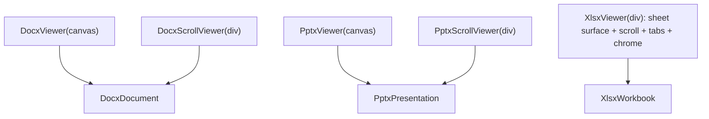
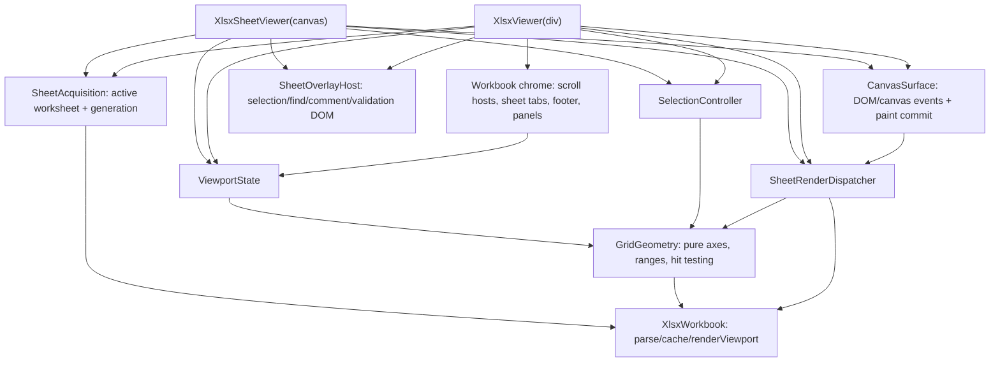
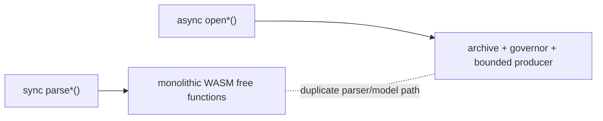
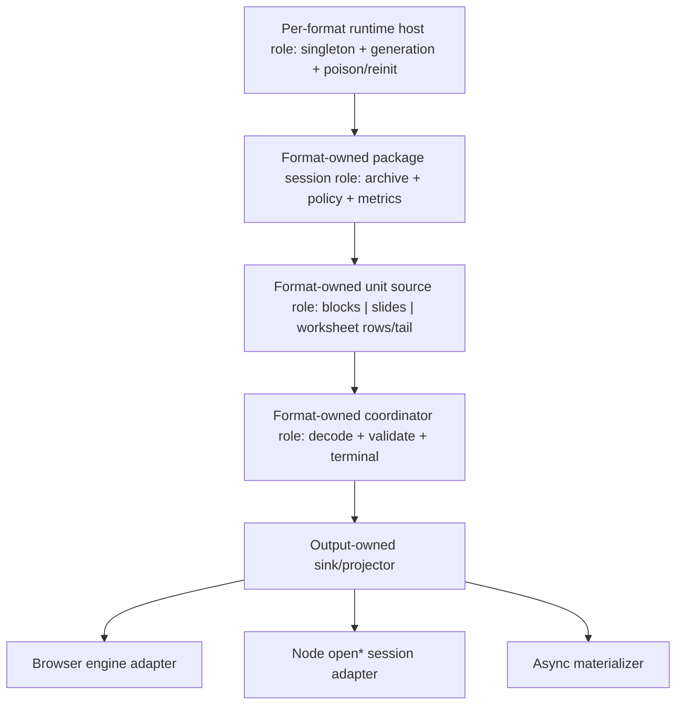

# OOXML public API convergence for 0.76

日本語版: [`api-architecture-0.76.ja.md`](api-architecture-0.76.ja.md)

Status: implemented in 0.76.0. This document is the architecture baseline for
maintaining the public API, ownership model, and responsibility boundaries in
0.76 and later releases.

Related issues: [#1133](https://github.com/yukiyokotani/office-open-xml-viewer/issues/1133),
[#1134](https://github.com/yukiyokotani/office-open-xml-viewer/issues/1134).

## Decision summary

Version 0.76 is an explicitly breaking minor release and will complete two
related API convergence efforts in one release:

1. Add the missing canvas-mounted XLSX sheet viewer and make the existing
   container-mounted workbook viewer compose the same sheet implementation.
2. Remove the synchronous Node materializing parser family after replacing the
   useful cases with asynchronous materializers backed by the same owned session
   pipeline as the `open*` APIs.

The release also adds the configurable archive-entry-count policy from #1133
through the existing shared resource-governance control plane.

The unifying rule is **one canonical acquisition, unit source, and
decode/validation coordinator for each format-owned unit**:

- DOCX produces sequential document blocks and lays them out into pages.
- PPTX produces complete slides.
- XLSX produces complete worksheet rows plus one terminal worksheet tail.

Viewers, Node sessions, and materializing conveniences may use different
output-owned projectors, but they must consume the same validated units. They
must not parse, normalize, account for, or terminally validate the same OOXML
content through separate implementations.

## Goals

- Make the Browser API structurally symmetric without pretending that a page,
  slide, and worksheet have identical layout semantics.
- Make the owned asynchronous Node sessions the only production parser and
  resource-lifecycle path.
- Remove duplicate parser, normalization, resource-policy, worker-dispatch, and
  viewer surface logic.
- Preserve format-specific operations where they are real: DOCX pagination is
  sequential, PPTX slides are independent units, and XLSX displays a bounded
  viewport into a potentially enormous worksheet.
- Deliver the new API, migrations, implementation convergence, tests, and
  documentation together in 0.76.

## Non-goals

- A single generic public `OfficeViewer<T>` abstraction.
- Identical content-access methods for page, slide, and worksheet models.
- Rendering an entire XLSX worksheet into one bitmap.
- Keeping a synchronous Node API by blocking a Promise with workers or
  `Atomics.wait`.
- Retaining old and new parser implementations for a deprecation window.

## Symmetry without false unification

Symmetry in this design means recognizable roles and consistent ownership, not
one shared content model or one generic implementation. DOCX pagination, PPTX
slide acquisition, and XLSX worksheet streaming are separate concepts and stay
separate.

The role vocabulary below is an architectural checklist applied inside
each format package. It does not require a common `FormatUnitSource` interface,
base class, generic coordinator/projector, or shared state machine for format
semantics. Concrete implementations remain format-named and format-owned, for
example a DOCX unit coordinator with layout/model projectors, PPTX slide
repository/preflight projector, and XLSX worksheet row/tail coordinator.

Only mechanics proven identical are shared: package policy normalization,
archive ownership, format-runtime generation/poison/reinit, pull credit/ACK transport,
terminal-outcome precedence, static bitmap ownership, and pure zoom math. If a
shared helper needs page/slide/worksheet-specific branching, it is too broad and
the behavior stays in the format package.

## Invariants

1. Every opened OOXML package has one retained archive owner, one resource
   governor, one normalized policy, and one terminal close/failure outcome.
2. `close()` and `destroy()` are idempotent. Resource-dependent work after close
   rejects; retained immutable metadata remains readable.
3. Browser main mode, browser worker mode, and Node use the same format-owned
   parser/projector and the same policy/error vocabulary.
4. Materialization consumes the canonical bounded unit source and canonical
   decode/validation coordinator through an explicit output-owned sink. It is
   not a second WASM free-function parser path.
5. A materialized result is explicitly documented as caller-owned memory
   proportional to its contents.
6. Composite viewers compose their format's focused-view internals; they do not copy rendering,
   selection, hit-testing, text-layer, or worker/bitmap dispatch logic.
7. Shared lifecycle and transport code belongs in `core`; shared OOXML package
   and parser policy belongs in `ooxml-common`; format semantics remain in their
   format package.

## Browser architecture before 0.76

### Public surface

| Layer | DOCX | PPTX | XLSX |
| --- | --- | --- | --- |
| Owned rendering engine | `DocxDocument` | `PptxPresentation` | `XlsxWorkbook` |
| Canvas-mounted focused view | `DocxViewer(canvas)` | `PptxViewer(canvas)` | missing |
| Container-mounted composite | `DocxScrollViewer(div)` | `PptxScrollViewer(div)` | `XlsxViewer(div)` |
| Render unit | page | slide | worksheet viewport |

`XlsxWorkbook.renderViewport()` is a valid low-level rendering primitive, but it
is not a Viewer. Its caller must load worksheets, derive viewport geometry,
schedule redraws, handle main/worker differences, maintain selection, and map
pointer coordinates itself.

### Current dependencies



The DOCX and PPTX unit and scroll viewers both call their engine correctly, but
each viewer owns variants of render scheduling, main/worker bitmap transfer,
canvas generation guards, zoom, overlay, and error routing. The XLSX viewer is a
single large class in which sheet drawing and interaction are coupled to the
container chrome.

## Current Browser architecture (0.76+)

### Public surface

<!-- viewer-api-symmetry-contract -->

| Layer | DOCX | PPTX | XLSX |
| --- | --- | --- | --- |
| Owned rendering engine | `DocxDocument` | `PptxPresentation` | `XlsxWorkbook` |
| Canvas-mounted focused view | `DocxViewer(canvas)` | `PptxViewer(canvas)` | `XlsxSheetViewer(canvas)` |
| Container-mounted composite | `DocxScrollViewer(div)` | `PptxScrollViewer(div)` | `XlsxViewer(div)` |
| Primary navigation | `goToPage()` | `goToSlide()` | `goToSheet()` |
| Primary count | `pageCount` | `slideCount` | `sheetCount` |

This table aligns host integration and lifecycle contracts only. It does not
claim that a DOCX page, PPTX slide, and XLSX sheet are equivalent domain units,
or that Viewer boundaries should be forced into one abstraction. Each format
keeps its natural concern: one DOCX page, one PPTX slide, or one active XLSX
sheet viewport.

The engine method correspondence is intentionally explicit:

| Contract | DOCX | PPTX | XLSX |
| --- | --- | --- | --- |
| Parse and retain package | `DocxDocument.load()` | `PptxPresentation.load()` | `XlsxWorkbook.load()` |
| Direct Canvas render | `renderPage(target, pageIndex, options)` | `renderSlide(target, slideIndex, options)` | `renderViewport(target, sheetIndex, range, options)` |
| Bitmap render | `renderPageToBitmap(pageIndex, options)` | `renderSlideToBitmap(slideIndex, options)` | `renderViewportToBitmap(sheetIndex, range, options)` |
| Render-mode owner | `DocxDocument.mode` | `PptxPresentation.mode` | `XlsxWorkbook.mode` |
| Release retained resources | `destroy()` | `destroy()` | `destroy()` |

The two viewer tiers follow the same acquisition and ownership contract:

| Contract | DOCX | PPTX | XLSX |
| --- | --- | --- | --- |
| Canvas target | `DocxViewer(canvas)` | `PptxViewer(canvas)` | `XlsxSheetViewer(canvas)` |
| Composite target | `DocxScrollViewer(container)` | `PptxScrollViewer(container)` | `XlsxViewer(container)` |
| Viewer-owned acquisition | `viewer.load(source)` | `viewer.load(source)` | `viewer.load(source)` |
| Borrowed engine factory | `fromDocument()` | `fromPresentation()` | `fromWorkbook()` |
| Borrowed-engine rule | `load()` rejects; caller destroys engine | `load()` rejects; caller destroys engine | `load()` rejects; caller destroys engine |

`load()` and the named engine factories are not two competing sources on one Viewer. They
select two mutually exclusive ownership modes:

- `new Viewer(target)` followed by `viewer.load(source)` is the convenience path.
  The Viewer creates, replaces, and destroys its engine.
- `Viewer.fromDocument()`, `Viewer.fromPresentation()`, or
  `Viewer.fromWorkbook()` is the reuse path.
  The caller can share one parsed engine across multiple views; the Viewer may
  not replace it and never destroys it.

Keeping both paths avoids forcing the common one-view case to manage an engine
explicitly, while avoiding duplicate parsing, archive caches, workers, and font
registrations in master/detail and multi-window cases. Public examples should
lead with `viewer.load()` and present named factories as the advanced reuse path.

The existing public names remain stable. We do not add an `XlsxScrollViewer`
alias: the container component is a workbook viewer with sheet tabs and a
scrollable cell grid, not a list of whole sheets.

Each Canvas-mounted and container-mounted Viewer exposes its format-specific
named factory. In all six cases the borrowed engine owns its
render mode and lifecycle: a conflicting explicit `mode` is rejected, `load()`
is unavailable, and Viewer teardown does not destroy the borrowed engine. The
factories are synchronous because their engines are already loaded; rendering
and navigation remain asynchronous where they were asynchronous before.

### XLSX canvas-viewer contract

`XlsxSheetViewer` is a canvas-mounted view of one active worksheet viewport. It
owns no sheet-tab/footer chrome. Native worksheet scrollbars are enabled by
default and can be disabled explicitly when a host supplies its own viewport
navigation. Because a worksheet is not a finite page, it additionally exposes
format-specific viewport movement. That extra state is not forced onto DOCX or
PPTX.

`XlsxWorkbook.renderSheet()` is deliberately absent. An OOXML worksheet can
contain 1,048,576 rows and 16,384 columns, far beyond browser Canvas dimension
and backing-memory limits. Unlike a DOCX page or PPTX slide, a worksheet is not
a finite paint unit with one natural Canvas size. The low-level contract
therefore requires an explicit `ViewportRange` through `renderViewport()`;
`XlsxSheetViewer` supplies the higher-level "one sheet" experience by owning the
scroll offset, visible range, resize projection, and redraw scheduling. A future
full-sheet export API would need explicit bounds plus tiling or pagination and
must not be a misleading `renderSheet()` alias.

### Symmetry enforcement

`scripts/check-viewer-api-symmetry.mjs` validates the committed public declaration
baselines for all three formats. It checks engine `load`/mode/count/render/bitmap/
destroy contracts, Canvas and container constructor targets, Viewer `load`, zoom,
navigation and destroy methods, named borrowed-engine factories, and the absence
of the old `document`/`presentation`/`workbook` injection options. It also rejects
an unbounded `XlsxWorkbook.renderSheet()` and
requires this section in both language variants. `check:public-api:built` runs it
in CI after declaration-baseline validation, so an intentional API evolution
must update the implementation, baseline, symmetry matrix, and documentation
together.

All mount DOM, styles, DPR reads, and document listeners resolve from
`canvas.ownerDocument` and its `defaultView`. A parent page can therefore retain
one `XlsxWorkbook` and mount borrowed sheet viewers into same-origin popup
canvases without reparsing the package.

The public declaration is frozen before implementation around this contract:

```ts
export interface XlsxViewportOffset {
  /** Logical horizontal CSS pixels from the sheet start; always >= 0. */
  readonly x: number;
  /** Logical vertical CSS pixels from the sheet top; always >= 0. */
  readonly y: number;
}

export interface XlsxScrollToCellOptions {
  readonly align?: 'nearest' | 'start' | 'center' | 'end';
}

export interface XlsxSheetViewerOptions extends LoadOptions {
  readonly cellScale?: number;
  readonly resizable?: boolean;
  readonly showScrollbars?: boolean;
  readonly zoomMin?: number;
  readonly zoomMax?: number;
  readonly onScaleChange?: (scale: number) => void;
  readonly onReady?: (sheetNames: string[]) => void;
  readonly onSheetChange?: (index: number, total: number) => void;
  readonly onViewportChange?: (offset: XlsxViewportOffset) => void;
  readonly onSelectionChange?: (selection: CellRange | null) => void;
  readonly onHyperlinkClick?: (target: HyperlinkTarget) => void;
  readonly enableHyperlinks?: boolean;
  readonly selectionColor?: string;
  readonly findHighlightColors?: FindHighlightColors;
  readonly mode?: 'main' | 'worker';
  readonly hiddenSheetMode?: HiddenSheetMode;
  readonly onError?: (error: Error) => void;
}

export class XlsxSheetViewer implements ZoomableViewer {
  static fromWorkbook(
    canvas: HTMLCanvasElement,
    workbook: XlsxWorkbook,
    options?: XlsxSheetViewerOptions,
  ): XlsxSheetViewer;
  constructor(canvas: HTMLCanvasElement, options?: XlsxSheetViewerOptions);
  load(source: string | ArrayBuffer): Promise<void>;
  readonly sheetIndex: number;
  readonly sheetCount: number;
  readonly sheetNames: string[];
  readonly canvasElement: HTMLCanvasElement;
  goToSheet(index: number): Promise<void>;
  nextSheet(): Promise<void>;
  prevSheet(): Promise<void>;
  getViewportOffset(): XlsxViewportOffset;
  setViewportOffset(offset: XlsxViewportOffset): Promise<void>;
  scrollToCell(ref: string, options?: XlsxScrollToCellOptions): Promise<void>;
  relayout(): Promise<void>;
  getScale(): number;
  setScale(scale: number): void;
  zoomIn(): void;
  zoomOut(): void;
  fitWidth(): void;
  fitPage(): void;
  getCellAt(clientX: number, clientY: number): CellAddress | null;
  readonly selection: CellRange | null;
  select(ref: string): void;
  setSelectionColor(color: string): void;
  setHiddenSheetMode(mode: HiddenSheetMode): Promise<void>;
  readonly hiddenSheetMode: HiddenSheetMode;
  readonly visibleSheetCount: number;
  findText(query: string, options?: FindMatchesOptions): Promise<FindMatch<XlsxMatchLocation>[]>;
  findNext(): Promise<FindMatch<XlsxMatchLocation> | null>;
  findPrev(): Promise<FindMatch<XlsxMatchLocation> | null>;
  clearFind(): void;
  getResourceMetrics(): Promise<OoxmlResourceMetrics>;
  destroy(): void;
}

export interface XlsxViewerOptions extends XlsxSheetViewerOptions {
  readonly showZoomSlider?: boolean;
}
```

`fromWorkbook()` follows the same named-factory contract as `fromDocument()` on
the DOCX viewers and `fromPresentation()` on the PPTX viewers. `load()` is
unsupported on the returned Viewer, the engine's render mode is authoritative,
and Viewer teardown does not destroy the caller-owned engine. Callers await
`goToSheet(index)` when
they need deterministic first-paint completion. Multiple sheet viewers share
parsing, archive access, worksheet materialization, and immutable content caches
while retaining independent viewport, selection, zoom, resize, outline, and
render-generation state.

Offsets are logical CSS pixels at the current scale: `x` increases from the
logical sheet start (column A, independent of browser RTL `scrollLeft`
conventions) and `y` increases downward. Fractional/partial cells are therefore
representable. Inputs are finite, clamped to the used scroll extent, and the
callback receives the resulting clamped value.

The canvas CSS box defines viewport width/height; DPR affects only backing-store
resolution. `relayout()` re-reads that box. The viewer uses the shared
caller-canvas lifecycle to wrap and restore the canvas. Wheel/trackpad input pans
the viewport, including when native scrollbars are explicitly hidden;
touch-pinch remains outside this release.

`destroy()` is idempotent and permanently closes the instance. After destroy,
async mutations (`load`, navigation, viewport/relayout, hidden-mode changes,
and find traversal) reject with `Error("XlsxSheetViewer is destroyed")`;
synchronous mutations (selection, color, clear-find, and zoom calls) throw that
error synchronously. `getCellAt()` returns `null`. Immutable retained snapshots
(`sheetIndex`/count/names, viewport offset, selection, scale, hidden mode/count,
last resource metrics, and `canvasElement`) remain readable. The caller canvas
has already been restored, and every late bitmap is disposed rather than
committed.



These are internal composition units, not public abstractions. Every
`XlsxViewer` and `XlsxSheetViewer` instance instantiates the same implementations
with its own state; the two facades never copy those implementations or share
one mutable runtime instance.

The extracted responsibilities are:

- `SheetAcquisition`: worksheet loading and generation-safe replacement;
- pure `GridGeometry`: row/column axes, frozen panes, visible range, and hit tests;
- `ViewportState`: logical offset, scale, and viewport extent;
- `SelectionController`: active cell and selection transitions;
- `SheetRenderDispatcher`: render scheduling, generation checks, and main/worker
  bitmap ownership;
- `CanvasSurface`: canvas/DPR sizing and pointer/keyboard event adaptation;
- `SheetOverlayHost`: selection/find overlays and anchored comment/validation
  panels inside the mount-specific canvas wrapper.

The shared components emit interaction events and anchor geometry. Each facade
instantiates the same overlay-host implementation in its own canvas wrapper.
The container viewer alone owns native scroll elements, workbook tabs, footer
controls, and zoom chrome.

### DOCX/PPTX viewer convergence

DOCX and PPTX keep separate format adapters but share implementation primitives
for behavior that is already semantically identical:

- static generation-safe canvas render-result dispatch (`main` canvas versus
  worker bitmap);
- caller-owned canvas mounting/restoration;
- text, hyperlink, and find-highlight overlay hosting;
- render cancellation/stale-result disposal;
- common zoom calculations and lifecycle error routing.

PPTX media presentation handles and per-slot media lifetimes remain PPTX-owned;
they are not forced through the static bitmap dispatcher. The scroll viewers
reuse the same static format adapter used by the single-canvas
viewer. Virtualization, pooled slots, visible-range calculation, and scroll
anchoring remain scroll-viewer responsibilities. This avoids a false generic
layout engine while removing duplicate mechanics.

## Current Node architecture

The public `@silurus/ooxml/node` subpath currently contains two generations.

### Synchronous materializers

- `parseDocx()` calls the monolithic `parse_docx` WASM export.
- `parsePptx()` calls the monolithic `parse_pptx` WASM export.
- `parseXlsx()` calls `parse_xlsx`; `parseXlsxSheet()` separately reopens and
  reparses the package; `parseXlsxAllSheets()` repeats the sheet materializer.

These functions return useful models immediately, but they do not share the
owned session's resource policy, cancellation, metrics, retained archive, or
cleanup contract.

The public `extractPptxMedia()` and `extractPptxImage()` helpers are a third
escape path: they reopen a package and call free WASM extraction exports without
the owned session policy/lifecycle. They are part of the 0.76 migration scope.

### Asynchronous owned sessions

- `openDocxDocument()` consumes the bounded document cursor, lays out pages,
  renders them, and closes explicitly.
- `openPptxPresentation()` consumes complete slides from a retained archive.
- `openXlsxWorkbook()` retains the workbook index and streams worksheet rows.

The sessions share lifecycle concepts, but format packages and the Node facade
still duplicate some archive opening, resource metrics, transport setup, failure
normalization, and close orchestration.



## Target Node architecture

### Mandatory canonical roles

Each format has the following mandatory internal roles used by Browser engines,
the Node facade, and materializers:

1. A per-format, per-JavaScript-realm runtime host owns the wasm-bindgen module
   singleton, `WasmParserHost`, runtime generation, live archive registrations,
   poison transition, and reinitialization.
2. An owned package session belongs to one runtime generation and owns one
   archive handle, normalized policy/governor, metrics, abort, and close.
3. A format-owned unit source is the only acknowledged source of document
   blocks, slides, or worksheet row/tail units.
4. A canonical format unit coordinator is the only implementation of wire
   decoding, normalization, accounting, ACK order, terminal validation, and
   rollback/commit eligibility.
5. Explicit output-owned sinks/projectors consume those validated units. DOCX
   has separate `DocxLayoutProjector` and `DocxCompatibilityMaterializer` sinks;
   they may differ in retained ownership but never reparse, renormalize, or
   revalidate the unit stream.

These roles are implemented separately per format. They share low-level
ownership/transport primitives, not a generic content-session API.

Because wasm-bindgen is a module singleton, a session must not reinitialize WASM
independently. A trap atomically poisons every live session in that format/runtime
generation, detaches their now-invalid archive handles without calling into the
discarded instance, and performs one runtime reinitialization. Existing sessions
remain failed; subsequently opened sessions use the new generation. Isolating
individual sessions in separate workers may remain an environment optimization,
but does not change this realm-local safety contract.

Environment adapters supply Worker versus in-process transport and Browser
versus Node canvas/resource services. They do not own a second parser state
machine, unit coordinator, poison policy, or reinitialization path.



Small lifecycle primitives, the terminal-outcome helper, and proven-identical
in-process/Worker transport mechanics live in `core`; each format composes its
own state transitions from them. Archive preflight and resource enforcement
live in `ooxml-common`. Complete-unit parsing, model projection, and layout
semantics remain format-owned behind explicit internal build entry points such
as `@silurus/ooxml-docx/internal/session`. The Node facade may adapt source bytes
and Node canvas services, but may not deep-import parser/WASM implementation
files or rebuild format orchestration.

For DOCX specifically, a private canvas-free `DocxAcquisitionSession` owns the
archive and document cursor. One `DocxDocumentUnitCoordinator` decodes and
terminally validates every unit. `openDocxDocument()` attaches a
`DocxLayoutProjector` and creates measurement services;
`materializeDocxDocument()` attaches a `DocxCompatibilityMaterializer`. Neither
sink constructs the other document-sized graph, and neither owns parsing,
normalization, accounting, ACK, or terminal validation.

### Public Node surface after 0.76

The canonical owned APIs remain:

```ts
openDocxDocument(source, options)
openPptxPresentation(source, options)
openXlsxWorkbook(source, options)
```

They retain their format-specific operations (`pages()`, `slides()`, and
`worksheetRows()`). Common lifecycle semantics are tested through one shared
contract suite rather than forced through a generic public interface.

The synchronous functions are removed:

```ts
parseDocx
parsePptx
parseXlsx
parseXlsxSheet
parseXlsxAllSheets
```

Useful full-model/index cases receive explicitly asynchronous and explicitly
materializing replacements:

```ts
materializeDocxDocument(source, options): Promise<DocxDocumentModel>
materializePptxPresentation(source, options): Promise<Presentation>
materializeXlsxWorkbookIndex(source, options): Promise<ParsedWorkbook>
materializeXlsxWorksheet(source, sheetIndex, options): Promise<Worksheet>
materializeXlsxWorkbook(source, options): Promise<MaterializedXlsxWorkbook>
```

Except for the index-only case below, these functions normalize the same options,
open the canonical owned producer, pass its validated units through the canonical
coordinator into an output-owned sink, and close in `finally`. They must use the
same internal acquisition session, unit source, and coordinator as `open*` rather
than calling the public rendering-oriented wrapper when format requirements
differ. They may not call a monolithic `parse_*` or `parse_sheet` compatibility
export.

`materializeXlsxWorkbookIndex()` is intentionally metadata-only. It opens the
canonical owned package session, obtains the workbook bootstrap through the same
index decoder/normalizer used by `openXlsxWorkbook()`, detaches the caller-owned
index, and closes without opening a worksheet cursor.

The XLSX ownership contract is explicit:

```ts
export type ReadonlyParsedWorkbook = DeepReadonly<ParsedWorkbook>;

export interface XlsxWorkbookSession {
  readonly workbookIndex: ReadonlyParsedWorkbook;
  readonly sheetCount: number;
  readonly sheetNames: readonly string[];
  readonly resourceUsage: OoxmlResourceUsageSnapshot | undefined;
  worksheetRows(sheetIndex: number): AsyncGenerator<XlsxWorksheetRowChunk>;
  close(): Promise<void>;
}

export interface MaterializedXlsxWorkbook {
  readonly workbookIndex: ParsedWorkbook;
  /** Caller-owned worksheets in workbook sheet-index order. */
  readonly worksheets: readonly Worksheet[];
}
```

`workbookIndex` remains readable after close and is recursively frozen at runtime
(not merely typed readonly) so JavaScript callers cannot mutate shared
strings/styles used by an active row assembler. The session may safely use that
same frozen graph for reads without retaining a second copy. A
materializer returns detached caller-owned metadata and worksheets; every
terminal worksheet is detached before the session closes. The workbook-index-
only result is not misleadingly called a fully materialized workbook.

Node rendering helpers and the `ooxml-thumbnail` CLI migrate to the owned session
path before the synchronous exports are deleted. PPTX image/media extraction is
performed through an open session; source-based extraction conveniences, if
retained, become asynchronous `finally`-closing wrappers over that session.

The 0.76 migration table is fixed as follows; no export is removed before its
listed replacement is complete:

| 0.75 export | 0.76 replacement |
| --- | --- |
| `parseDocx()` | `await materializeDocxDocument()` |
| `parsePptx()` | `await materializePptxPresentation()` |
| `parseXlsx()` | `await materializeXlsxWorkbookIndex()` |
| `parseXlsxSheet()` | `await materializeXlsxWorksheet()` |
| `parseXlsxAllSheets()` | `await materializeXlsxWorkbook()` |
| `extractPptxImage()` | `await session.getImage()` inside `openPptxPresentation()` |
| `extractPptxMedia()` | `await session.getMedia()` inside `openPptxPresentation()` |

### Lifecycle contract

Owned sessions have `opening`, `open`, `closing`, `closed`, and `failed` states.
Only the session owner may transition state. `close()` linearizes once and stores
one memoized Promise, rejects new resource-dependent work, awaits or cancels
accepted in-flight work according to the format operation contract, releases the
archive, and settles idempotently. Every repeated call returns that same
settlement, including a cleanup rejection. A parse/resource/abort failure is primary; cleanup failure is
reported only when no primary failure exists. `usingOwnedSession` centralizes
that precedence for materializers.

Immutable snapshots (`pageCount`/page sizes, slide dimensions/count,
`workbookIndex`/sheet names/count, last resource usage) remain readable after
close. Resource reads, rendering, extraction, and new streams reject.

DOCX `pages()` and PPTX `slides()` are terminal one-pass iterators and close the
whole session on exhaustion, break, or error. XLSX `worksheetRows()` closes only
its worksheet operation on exhaustion/break and leaves the workbook session open
for another sheet. These are separate format contracts in the shared tests, not
papered over as identical iteration semantics.

### Migration examples

Old:

```ts
const presentation = parsePptx(buffer);
```

New materialized use:

```ts
const presentation = await materializePptxPresentation(buffer);
```

New bounded sequential use:

```ts
const presentation = await openPptxPresentation(buffer, options);
try {
  for await (const slide of presentation.slides()) {
    // Consume one caller-owned slide.
  }
} finally {
  await presentation.close();
}
```

There is no synchronous wrapper around an asynchronous session. Worker threads
and `Atomics.wait` must not be used to imitate a synchronous API. Ordinary
asynchronous Worker transport and per-session Worker isolation remain allowed.

## Archive entry-count policy (#1133)

`OoxmlResourceLimits` gains:

```ts
maxArchiveEntries?: number | null;
```

The contract is:

- omitted: use the generated, calibrated standard default;
- positive safe integer at or below the internal hard ceiling: apply that public
  admission limit;
- `null`: disable only the public limit;
- zero, negative, fractional, non-finite, or above the hard ceiling: reject
  during option normalization before Worker or WASM creation.

The internal hard ceiling remains non-disableable. A public-policy crossing is
an `OoxmlResourceLimitError` with `metric: "entry-count"` and
`configurable: true`; the internal crossing uses the same metric with
`configurable: false`.

This is one atomic generated-policy/ABI change:

- add `defaults.maxArchiveEntries` to
  `packages/ooxml-common/resource-policy.json`;
- generate standard and hard entry-count constants for TypeScript and Rust;
- add the field to normalized policy and metrics snapshots;
- change all three WASM archive constructors and `resourcePolicyForWasm` to the
  three-value policy ABI;
- enforce Rust `public_entries` before the existing hard ceiling.

The default is chosen from recorded public and private corpus metrics with
documented headroom and generated from the policy manifest. Calibration must be
reproducible from a checked aggregate artifact or command. Selecting and
recording that value is an implementation gate; copying the current 20,000 hard
ceiling into the public default without calibration is not permitted.

The normalized policy travels as one object through Browser main mode, render
workers, Node sessions, metrics, debug output, TypeScript worker protocols, and
all three WASM archive constructors. No format-local option interpretation is
allowed.

## Source ownership and duplication rules

The following are release-blocking architecture violations:

- a production call to monolithic Node `parse_*`/`parse_sheet` WASM exports;
- any production browser or Node call to `parse_docx`, `parse_pptx`,
  `parse_xlsx`, `parse_sheet`, or archive `parse_sheet` outside an explicit
  native/test allowlist;
- legacy `parseSheet`/`parsedSheet` worker protocol arms;
- free-function PPTX image/media extraction outside an owned session;
- a second ACK/credit/cancel or unit decode/terminal-validation implementation in
  a format package;
- separate Browser and Node resource-policy normalization;
- `XlsxSheetViewer` copying methods from `XlsxViewer`;
- `XlsxViewer` maintaining a second grid geometry or hit-test implementation;
- DOCX/PPTX Viewer and ScrollViewer implementing separate main/worker dispatch
  state machines;
- materializers re-opening a package once per unit;
- public entry-count handling implemented independently in each format.

A repository-wide import/AST boundary check enforces the parser/export and
package-boundary rules. Public Node recovery tests for all three `open*` APIs
prove runtime-generation poisoning and reinitialization after a trap. Concurrent
tests keep two sessions open, trap one, verify both old-generation sessions fail
deterministically without stale-pointer access, and verify a new-generation
session succeeds.

Model materialization and render-oriented retained state may differ because they
serve different ownership contracts. That is intentional data ownership, not a
license to duplicate parsing or normalization algorithms.

## Delivery sequence

Several PRs may merge to `main`, but no package/site release is cut until all
gates below pass. Resource/Node convergence and Browser Viewer convergence are
separately gated workstreams shipped together; neither may weaken the other's
acceptance criteria.

1. Freeze the 0.76 API declarations and shared lifecycle/resource contracts.
2. Implement #1133 in the shared policy/governor path and all boundary tests.
3. Extract format runtime hosts, owned package sessions, format unit sources,
   canonical unit coordinators, and output-owned projectors; migrate Browser
   direct worksheet acquisition and Node `open*` adapters.
4. Add async materializers, equivalence tests, and migrate Node CLI/rendering
   consumers.
5. Remove synchronous parser/extraction exports, legacy worksheet worker
   protocol arms, and all monolithic production call paths.
6. Extract the XLSX sheet controller/surface, refactor `XlsxViewer` to use it,
   then add `XlsxSheetViewer` over the same implementation.
7. Consolidate shared DOCX/PPTX unit-viewer mechanics without merging their
   format layout semantics.
8. Update public API baselines, README, site API reference, examples, changelog,
   and one explicit 0.75-to-0.76 migration guide.
9. Complete independent architecture review, full CI, parser tests, declaration
   builds, Browser smoke tests, and private DOCX/XLSX/PPTX VRT.

## Release gates

- No old synchronous parser export remains in production declarations or bundle
  entry points.
- 0.76 is documented as breaking and has a per-export migration table for every
  removed parser/extraction function.
- No new materializer reaches a monolithic parser compatibility export.
- No Browser/Node production path reaches a forbidden monolithic parse/export
  call; the repository boundary check enforces this.
- Old/new overlap is proven equivalent before the old implementation is deleted;
  final tests use canonical expected models rather than shipping a legacy parser.
- `XlsxViewer` and `XlsxSheetViewer` instantiate the same acquisition, geometry,
  viewport, selection, dispatcher, and surface implementations, verified by
  focused dependency-boundary tests.
- DOCX/PPTX single and scroll viewers share one static render-result dispatch
  primitive while PPTX media and scroll-slot lifetimes stay format-owned.
- Cross-format session contract tests cover open, abort, resource failure,
  poisoning, metrics, idempotent close, and work-after-close.
- Per-format concurrent-session tests cover trap fan-out to every live runtime-
  generation session and successful future-session reinitialization.
- XLSX session tests prove `workbookIndex` is recursively frozen at runtime and
  remains readable after close without aliasing materializer-owned results.
- #1133 tests cover omitted/default, configured, `null`, invalid, above-hard,
  public crossing, and internal crossing in all environments.
- Public documentation clearly separates bounded sequential consumption from
  caller-owned materialization.
- Full private VRT is unchanged except for explicitly approved viewer UI output.

## Expected user impact

The normal Browser Viewer flow remains source-compatible. XLSX gains a smaller
canvas-mounted integration option, while the existing workbook viewer retains
its sheet tabs and scroll UI.

Node callers using `open*` gain the entry-count option without changing their
basic lifecycle. Callers using synchronous `parse*` must migrate to either an
async materializer or an owned session. In return, every supported Node path
gets consistent limits, cancellation, metrics, errors, archive reuse, and
deterministic cleanup.
